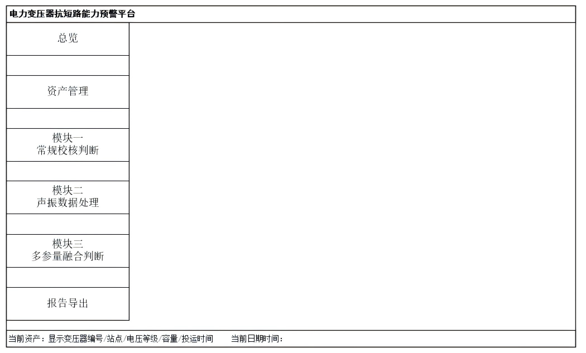
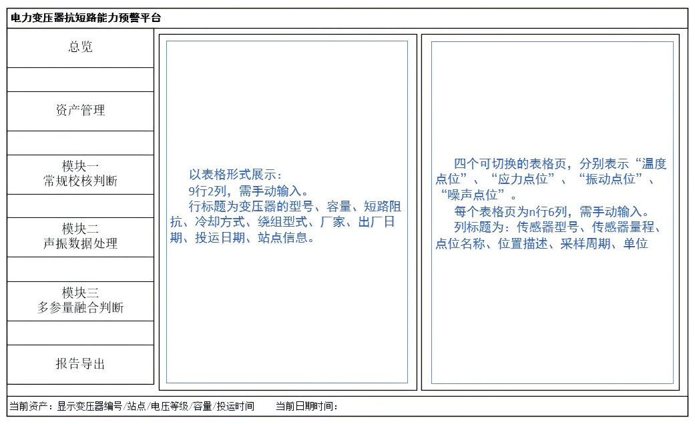
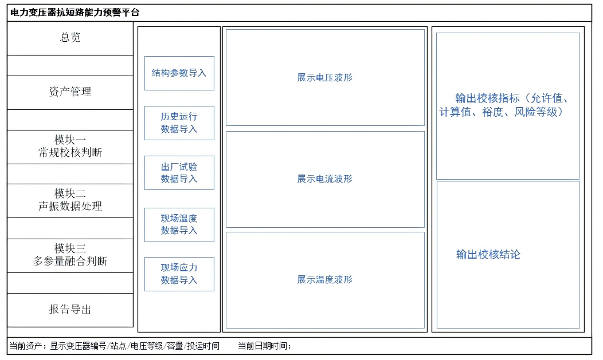
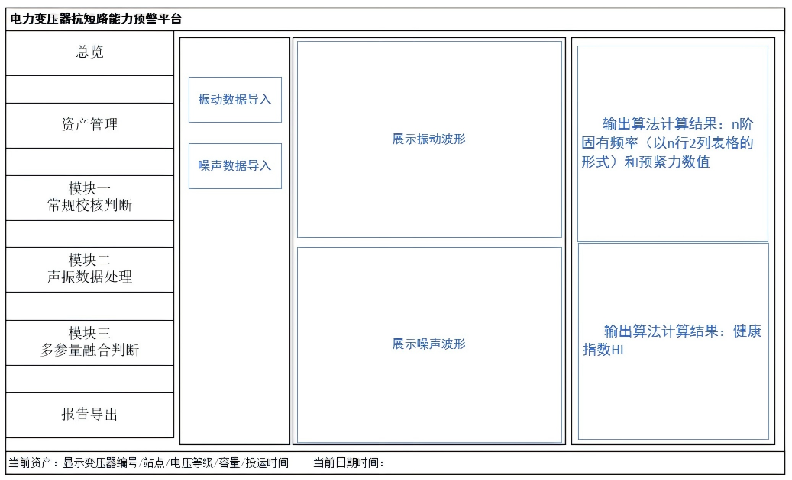
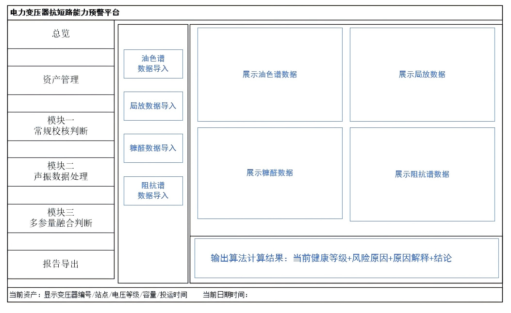
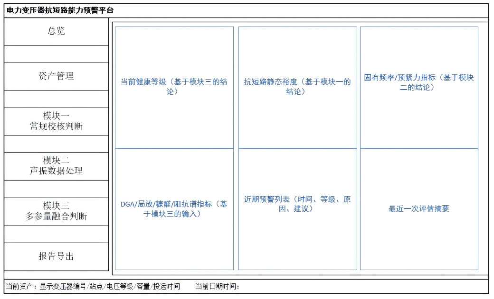

UI 草案（根据提供图片内容整理）

# 软件整体界面建议

## 1. 软件整体界面建议

### （1）左侧导航栏：
①总览；  
②用户管理；  
③模块一：常规校核判断；  
④模块二：产振数据处理；  
⑤模块三：多参数综合判断；  
⑥报告导出；  

### （2）顶部或底部侧栏：
①当前用户：显示完当前编号/站点电压等级/带量/起止时间；  
②当前日期时间；  
  
*图注：电力系统自动化辅助分析软件平台 - 左侧导航栏、顶部信息栏、主操作区、右侧提示区域*

---

## 2. 资产管理界面

### 页面布局：
（1）左侧：客户台账：（用手动输入）以表格形式展示  
- **变动的字段**：序号、短路阻抗、冷却方式、绕组形式、厂家、出厂日期、投运日期、站点信息  

（2）右侧，传感器配置：（用手动输入）以可增加项的表格形式展示  
①温度点位：传感器型号、传感器量程、点位名称、位置描述、采样周期、单位；  
②油压点位：传感器型号、传感器量程、点位名称、位置描述、采样周期、单位；  
③振动点位：传感器型号、传感器量程、点位名称、位置描述、采样频率、单位；  
④噪声点位：传感器型号、传感器量程、点位名称、位置描述、采样频率、单位；  

  
*图注：电力系统自动化辅助分析软件平台 - 左侧：客户台账；右侧：传感器配置（手动输入）*

---

## 3. 模块一：常规校核判断

### 页面布局：
（1）左侧：输入区  
①结构参数（模板化 excel 文件导入）  
- 绕组几何尺寸、导线/垫块结构、关键材料参数  
②历史运行数据（模板化 excel 文件导入）  
- 负荷电流/电压、油温/绕组温度、环境温度、短路冲击记录。
③出厂试验数据（模板化 excel 文件导入）  
- 短路阻抗、温升试验、例行试验关键结论、机械强度相关试验条目
④现场数据（txt、csv格式文件导入）
- 现场温度、应力数据导入
（2）中间：模型计算（参数摘要+计算按钮）
展示电压数据、电流数据、温度数据、应力数据随时间变化的折线图。
（3）右侧：输出区（校核结果、结论及建议）
输出校核指标（允许值、计算值、裕度、风险等级）及结论（通过/预警/告警）

  
*图注：电力系统自动化辅助分析软件平台 - 左侧：输入区；中间：模型计算；右侧：输出区*

---

## 4. 模块二：声振数据处理

### 页面布局：
（1）左侧：输入区（数据文件导入）  
①振动数据导入
- 对照“资产管理”界面中振动点位数量及顺序，展示表格。
- 批量导入多通道振动数据文件。数据文件顺序应与振动点位顺序一致。文件类型支持txt、csv。
②噪声数据导入  
- 对照“资产管理”界面中噪声点位数量及顺序，展示表格。
- 批量导入多通道噪声数据文件。数据文件顺序应与噪声点位顺序一致。文件类型支持txt、csv。

（2）右侧：输出区（输出说明）  
①振动波形展示：基于导入的振动数据文件，输出振动信号的时域波形；  
②噪声波形展示：基于导入的噪声数据文件，输出噪声信号的时域波形；  
③功率谱密度计算：基于前述计算结果，输出变压器的x向频谱频率（表格）；  
④频宽力计算：基于算法计算结果，输出变压器的预置力数值；  
⑤健康程度计算：基于算法计算结果，输出健康指数 HH。

  
*图注：电力系统自动化辅助分析软件平台 - 左侧：输入区；右侧：输出区*

---

## 5. 模块三：多参数综合判断

### 页面布局：
（1）左侧：输入区  
①油性能（DGA）数据输入（模板化文件导入）  
- 上游气体浓度（ppm）：H₂、CH₄、C₂H₆、C₂H₄、CO、CO₂  
- 随时时段（采样时间）  

②局放数据输入（模板化文件导入）  
- 时间戳、测量通道名称、测量方法类型、放电强度指标、放电重复率、背景噪声水平

③糠醛数据输入（模板化文件导入）  
- 时间戳、2-FAL（单位为mg/L或ppb）、取样位置、油温、负荷 

④阻抗谱数据输入
- 时间戳、相别、接线方式、测试温度（模板化文件导入）
- 频率-幅值曲线（txt、csv格式导入）
- 基准曲线（txt、csv格式导入） 

（2）右侧：输出区  
①基于上传文件综合输入数据的图表与曲线；  
②基于后台算法给出结论：当前健康等级+风险等级+原因解析+建议  

  
*图注：电力系统自动化辅助分析软件平台 - 左侧：输入区；右侧：输出区*

---

## 6. 结论总览

### 页面布局：
6张卡片分别是  
①当前健康等级（基于模块二的结论）  
②抗短路静态强度（基于模块一的结论）  
③现有频率/强度力指标（基于模块二的结论）  
④DGA/油/故障/增流指标（基于模块三的输入）  
⑤近期预警列表（时间、等级、原因、建议）  
⑥最近一次评估摘要  

  
*图注：电力系统自动化辅助分析软件平台 - 总览页面布局*

---

## 7. 报告导出

- 一键生成报告：包含输入数据概览、三级快决策、融合结论及建议  
- 导出格式：pdf/word

界面布局不限制

